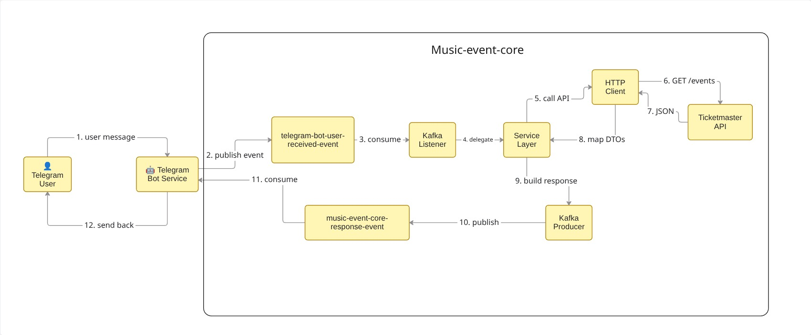

# Music Event Core
Core service for music event. Take messages from Kafka and send answer to Telegram

## Useful urls for test: 
- https://music-event-bot.duckdns.org/grafana/dashboards
- https://music-event-bot.duckdns.org/music-event-core/actuator/health 
- https://music-event-bot.duckdns.org/kafka-ui

### App uses Strimzi opensource product for Kafka https://strimzi.io/docs/operators/latest/deploying :

* Strimzi Custom kinds (added by Strimzi operator):
  * Kafka - defines a Kafka cluster
  * KafkaNodePool - defines a group of Kafka nodes
  * KafkaTopic - defines a Kafka topic
  * KafkaUser - defines a Kafka user

1. kind: Kafka - The Cluster Definition
   This is the main Kafka cluster configuration. It defines:
*     How Kafka should behave
*     What features to enable
*     How to connect to it
*     Global settings

2. kind: KafkaNodePool — The Node Pool Definition
   This defines a group of Kafka nodes. It defines:
*     How many nodes to have
*     What features to enable
*     How to connect to them
*     Global settings

